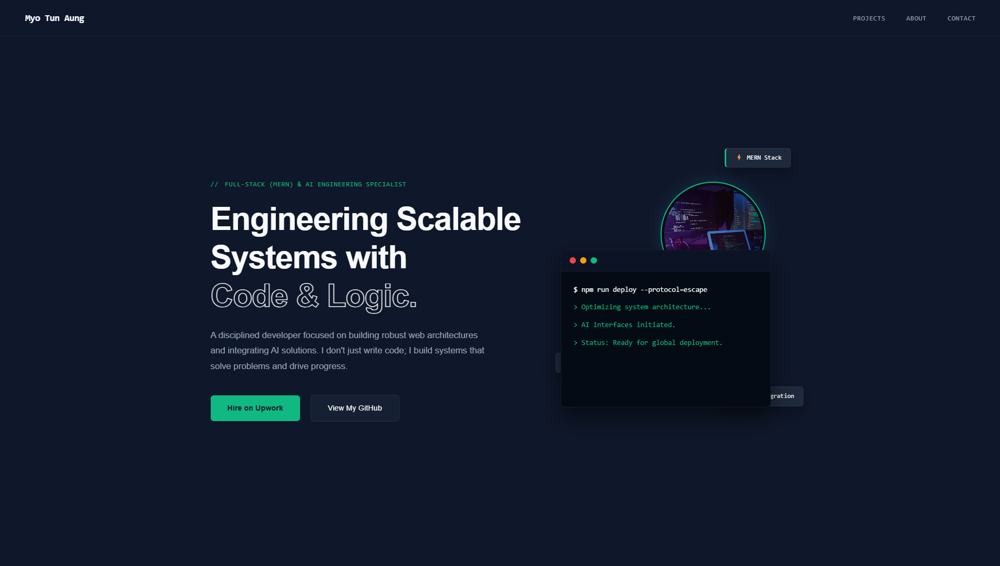

# 🚀 Myo Tun Aung - Professional Portfolio



A carefully optimized, component-driven client-side application featuring lightweight rendering, structural code patterns, and a modern terminal-inspired UI. Built to showcase my expertise in Full-Stack (MERN) development and AI integration.

## ✨ Key Features

- **Modern UI/UX:** Dark theme with a terminal-inspired aesthetic and neon glow effects.
- **Performance Optimized:** Lazy loading, optimized assets, and minimal DOM manipulation.
- **Component-Driven Architecture:** Clean, scalable, and modular React folder structure.
- **Intersection Observer Animations:** Smooth, scroll-triggered reveal animations without heavy libraries.
- **Responsive Design:** Mobile-first approach ensuring perfect display across all devices.
- **Multi-language Support (i18n):** Seamless switching between English and Myanmar (Coming Soon).

## 🛠️ Tech Stack

- **Frontend:** React (Vite), CSS3 (Flexbox/Grid), HTML5
- **Deployment:** Vercel / Netlify
- **Version Control:** Git & GitHub (Feature Branch Workflow)

## ⚙️ Local Installation

To run this project locally, follow these steps:

1. **Clone the repository:**
    ```bash
    git clone https://github.com/myotunaungdev-pro/portfolio.git
    ```

2. **Navigate to the project directory:**
    ```bash
    cd portfolio
    ```

3. **Install dependencies:**
    ```bash
    npm install
    ```

4. **Set up environment variables:**
    Create a `.env` file in the root directory and add your API keys (if any):
    ```env
    VITE_EMAIL_SERVICE_ID=your_service_id
    VITE_EMAILJS_TEMPLATE_ID=your_template_id
    VITE_EMAILJS_PUBLIC_KEY=your_public_key
    ```

5. **Start the development server:**
    ```bash
    npm run dev
    ```

### 📬 Contact & Links

* **GitHub:** [@myotunaungdev-pro](https://github.com/myotunaungdev-pro)
* **Email:** [myotunaung.dev@gmail.com](myotunaung.dev@gmail.com)

*Designed and built with ❤️ by Myo Tun Aung.*